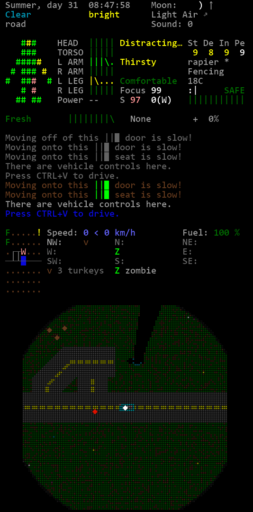

# CDDA Structured Sidebar



A compact, structured sidebar mod for [Cataclysm DDA](https://cataclysmdda.org/).

## Features

* Structure! And separators for more clarity
* Compact block for environment and location
* Compact, multi-column block for all health and body-related stats
   * Compact bodygraph widget, also showing mouth and eyes status
* Compact widget containing overmap and compass, near the minimap. Everything at a glance for fast travel and driving!
   * Configurable minimap size: 5x5, 7x7, 9x9

## Installation

**Option 1: Download**

Use the green `Clone` button at the top right of this page (above the file list), there is an option `Download ZIP`.

Extract the downloaded file into your game's mods folder (`data/mods`). You can rename the resulting folder if desired.

**Option 2: Git clone**

Inside your game's mods folder (`data/mods`), run:

```shell
git clone https://github.com/mlange-42/cdda-structured-sidebar.git
```

**Enable the mod**

When creating a **new world**, add the mod `Structured Sidebar` as usual.

For an **existing world**, you can add `"Structured_Sidebar"` it to the mod list in `mods.json` in the world's save directory.

## Configuration

After installation, press `}` in-game to configure the sidebar.


In the right column, select `structured`. In the left column, turn off `Hint` (using `Tab`).

Try the three `Compass/Overmap` widgets to find your preferred overmap size.

> Hint: It is recommended to move the `Log` widget right above `Compass/Overmap 9x9`.

## Known issues

The mod replaces the "bodygraph"" widget in all other sidebars, by a more compact version. This is caused by a hard-coded source ID for the graph in CDDA.
However, you gain the benefit of seeing HP of eyes and mouth, too.
